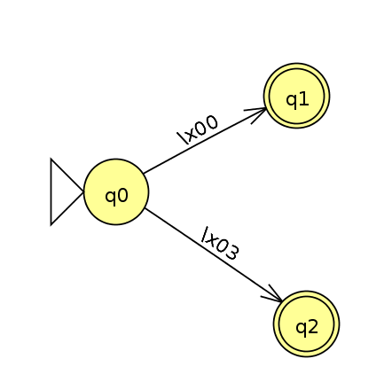

# Memoria PECL Procesadores del Lenguaje

## Introducción

Se propone la creación de un sistema capaz de realizar las fases de análisis léxico, sintáctico y semántico de un compilador de BASIC (dialecto de `ECMA-55 Minimal BASIC`). Para ello utilizaremos las herramientas **JFLex** y **CUP**. Con **JFLex** crearemos un sistema encargado de la generación de los tokens y la eliminación de caracteres innecesarios (análisis léxico). Con **CUP** haremos un analizador LALR que se encargará de la generación de un árbol de derivación de la gramática que definamos (análisis sintáctico), el manejo de errores y de tabla de símbolos; y, finalmente, de verificar que se cumplen las especificaciones semánticas.

## Ejecución de la práctica

Está todo montado para que *IntelliJ IDEA* lo reconozca, pero por si acaso, he generado una archivo *.jar* dentro del directorio *bin* para ejecutarla.

La lanzaríamos:

```
java -jar bin/PECL.jar [nombre_del_archivos_bas]
```

## Analizador léxico

Para el analizador léxico, como hemos comentado, utilizaremos **JFlex**. Símplemente tendremos que definir las expresiones regulares que generaran los tokens y definir la funcionalidad extra que le queramos dar (gestión de errores, clases específicas para la generación de los simbolos...).

### Especificaciones léxicas

Al principio iba a indicar las especificaciones léxicas con comentarios en el código del archivo `main.jflex` con el siguiente formato:

```java
/* EL [n]. {Descripción} */
```

Pero al aumentar la complejidad del código, considero necesario explicar algunas cosas de forma más detallada:

- **EL 4.**

Para los identificadores de variable he decidido hacer el análisis a través del léxico, y que devuelva un token `VAR_NUM` para las variables numéricas (sólo una letra) y `VAR_TXT` para las variables de cadena.

- **EL 5.**

Para los número enteros (`Num_Entero= [+-]?{Digito}+`) devuelvo el token `INTEGER`. Tanto para los números reales (`Num_Real = {Num_Entero}\.{Digito}+`) como para los escalares (`Num_Escalar = {Num_Real}[E]{Num_Entero}`) devuelvo el token `FLOAT`, porque ví que java interpreta correctamente los valores del tipo `1.2E5` como valores de coma flotante.


- **EL 6.**

Sólo he programado que se pasen por alto los espacios en blanco correspondientes a tabulaciones y a espacios, porque los saltos de línea quería que generasen un token para el analizador sintáctico (las lineas del programa terminan cuando reciben el token `CRLF`).

- **EL 7.**

Aunque encontré la forma de que el programa pudiese leer el *EOF* con la expresión `\x00 | \x03`, ví que el propio *JFlex* ofrece el método `<<EOF>>` y me parecía mucho más limpio y seguro.

### Requisitos léxicos

- **RL 1.**

Para cualquier caracter no definido en las especificaciones léxicas devuelvo un token `ERROR`, que puede ser recogido por el analizador sintáctico. Así mismo, imprimo por pantalla la línea y la columna en la que ha sido encontrado.

- **RL 2.**

Definidos en el apartado [Autómatas](#aut)

- **RL 3.**

Definidos en el apartado [Uso de estados léxicos](#lex_state)

- **RL 4.**

Durante el análisis léxico, voy recogiendo todos los tokens en la estructura `List<BASICSymbol> tokens`. Para hacerlo, defino el nombre que tiene que tener el método que devuelve el siguiente token (`%function nextToken`) y escribo una función `next_token` (que es a la que llamará *CUP*) que hace de interfaz de `nextToken` guardando los tokens en la estructura mencionada antes de devolverlos.

Al terminar todos los análisis, el programa principal imprime todos los token obtenidos. Por ejemplo, para la entrada:


```BASIC
0 REM programa_simple.bas
10 PRINT "Cual es tu nombre?: "
20 READ U$
30 DATA "Javier"
40 PRINT "Hola "; U$
50 PRINT "Cuantas estrellas quieres?: "
60 INPUT N
70 PRINT "Cuantas puntas tiene una estrella?: "
80 READ P
90 DATA 5
100 LET R = P * N
110 PRINT "Total:"; R ; " puntas"
120 PRINT "Adios !! "; U$
130 END
```

Obtendríamos la siguiente salida:

```
/**************************/
/** Análisis léxico     **/
/**************************/

[INTEGER(0), REM, CRLF, INTEGER(10), PRINT,
STRING(Cual es tu nombre?: ), CRLF, INTEGER(20), READ,
VAR_TXT(U$), CRLF, INTEGER(30), DATA, STRING(Javier), CRLF, INTEGER(40),
PRINT, STRING(Hola ), PCOMA, VAR_TXT(U$), CRLF, INTEGER(50), PRINT,
STRING(Cuantas estrellas quieres?: ), CRLF, INTEGER(60), INPUT, VAR_NUM(N),
CRLF, INTEGER(70), PRINT, STRING(Cuantas puntas tiene una estrella?: ),
CRLF, INTEGER(80), READ, VAR_NUM(P), CRLF, INTEGER(90), DATA, INTEGER(5),
CRLF, INTEGER(100), LET, VAR_NUM(R), EQU, VAR_NUM(P), MUL, VAR_NUM(N), CRLF,
INTEGER(110), PRINT, STRING(Total:), PCOMA, VAR_NUM(R), PCOMA, STRING( puntas),
CRLF, INTEGER(120), PRINT, STRING(Adios !! ), PCOMA, VAR_TXT(U$), CRLF,
INTEGER(130), END, CRLF, EOF, EOF, ]
```

### <tag id="lex_state">Uso de estados léxicos</tag>

He utilizado estados léxicos para generar los tokens `STRING` y `REM`.

- `%state STRING`

Para no capturar dentro del token las comillas del string, he creado un estado léxico al que se accede cuando se abren las comillas (`"`) y del que se sale (se vuelve a `YYINITIAL`) cuando se encuentran las de cierre, devolviendo el token con todo el contenido encontrado entre medias.

- `%state REM`

Como la declaración de que es una línea *REM* se produce después de el identificador de número de línea, si no introducía en el token (más bien, hago que el token se lo coma, porque no lo guardo) todo lo que hubiese hasta el salto de línea, el analizador sintáctico fallaba. Así que, ante el token `REM`, nos ponemos a pasar por alto cualquier entrada hasta el salto de línea.

### <tag id="aut">Autómatas y expresiones regulares</tag>

### CAR CADENA SIMPLE


`[+-.] | {Digito} | {Letra} | [a-z]`

### LETRA


`[A-Z]`

### DÍGITO


`[0-9]`

### CAR CADENA


`? | {Car_Cad_Delimitado}`

### CAR_CAD_DELIMITADO


`[!#$%&'()*,/:;<=>?\^_] | {Car_No_Delimitado}`

### CAD_DELIMITADA


`"{Car_Cad_Delimitado}*"`

### EOF



`\x00 | \x03`

### NUM ENTERO


`(+-)?{Digito}+`

### NUM REAL


`{Num_Entero}.{Digito}+`

### NUM ESCALAR


`{Num_Real}[E]{Num_Entero}`

### VARIABLE Y VARIABLE DE CADENA


```
{Letra}   -> VAR_NUM
{Letra}$  -> VAR_TXT
```

### Otros

Para la generación de los tokens he creado la clase `BASICSymbol`. Así puedo definir la expresión que quiero que devuelva en el método `toString()` (para depurar) y el comportamiento adicional que quiera.

<!-- TODO Otras cosas que quiera apuntar... -->

## Analizador sintáctico

Tanto para el analizador sintáctico como para el analizador semántico utilizaremos la librería **CUP**. Aquí definiremos la gramática, qué hacer con las producciones correctas, qué errores se pueden detectar y qué hacer comprobaciones adicionales a la gramática (comprobación de tipo, comprobación de orden de las sentencias...).

Defino el `programa` como `lineas`, `lineas` como un conjunto de producciones `linea`, y cada `linea` como un entero (token `INTEGER`) seguido por una `sentencia` y un salto de linea (token `CRLF`). Más adelante expondremos cada una de estas producciones.

###  Arbol de derivación

Para construir el árbol, todas las producciones generan un objeto java que hereda de la clase `Node`. Cuando una sentencia deriva en otra producción, la añado como nodo hijo con el método `addSonNode(n)` y a la hora de mostrar el árbol, lo recorro todo de forma recursiva hasta los nodos hoja. Nos extenderemos más en su descripción en el [requisito sintáctico 4](#rs4)

### Especificaciones sintácticas

- **ES 1.**

Las variables están recogidas en el no terminal `var`, que puede derivar en `var_num_simple`, `var_num_suscrita` o `var_cadena`. He decidido hacer estas derivaciones (en lugar de insertar directamente todo en `var`) para poder reutilizarlas si fuese necesario en alguna producción posterior.

- **ES 2.**

Para simplificar su uso más adelante, tanto los literales numéricos como las cadenas (`STRING`) pueden derivar de `literal`. Así, recojo los valores correspondientes a los nodos hoja en la producción `basic_expression`. En las expresiones binarias (suma, exponenciación, multiplicación...) compruebo el tipo del expresión básica para que sólo operen con expresiones de tipo numérico.

Para definir la precedencia en la gramática, he hecho que las operaciones con menor precedencia puedan derivar en las de mayor precedencia con recursividad a la izquierda. Así, tenemos por ejemplo el siguiente ejemplo con las expresiones relacionadas con la suma (y resta):

```
additive_expression ::= multiplicative_expression:e |
                        additive_expression:e1 SUM multiplicative_expression:e2 |
                        additive_expression:e1 SUB multiplicative_expression:e2;
```

Llegando hasta la de mayor precedencia, que puede derivar en las expresiones básicas:

```
pow_expression ::= basic_expression:e |
                   pow_expression:e1 POW basic_expression:e2;
```

- **ES 3.**

Para que las funciones puedan tener como parámetro otra función, todas derivan recursivamente en `funcion_suministrada` o pueden producir `additive_expression` para llegar hasta los símbolos terminales.

- **ES 4.**

Cuando se define una nueva función, sólo guardamos para identificarla en la tabla de símbolos el último caracter de su definición (FN**X** almacenaría sólo **X**). Como no comprobamos la completa validez de la función hasta el final del análisis sintáctico (en la fase de análisis semántico) sólo puede derivar en error si la expresión está mal formada o si el símbolo ya está definido como variable numérica.

- **ES 5.**

En la asignación (en esta fase) sólo hacemos comprobación de tipos y si existe o no en la tabla de símbolos.

- **ES 6.**

Con esta producción he tenido algún problema al principio por la comprobación de tipos porque *hereda* de las expresioens binarias, y al tener recursividad, uno de los dos parámetros puede no ser de tipo numérico. Al final lo he resuelto definiendo el nuevo tipo en la clase de java correspondiente.

- **ES 7. y ES 8.**

Lo más reseñable de esta especificación son las sentencias `FOR` y `GOSUB`. He tenido que tratar las dos de forma especial en el análisis final del programa. Mientras que el resto de sentencias acaban siendo una linea que cuelga del nodo `Programa`, cuando detecto una sentencia `FOR` o una `GOSUB` anido el resto de lineas hasta llegar a `NEXT` o `RETURN` (respectivamente).

Al principio había definido directamente en la gramática del `FOR` algo parecido a:

```
for_to ::= FOR var:v1 EQU funcion:f1 TO funcion:f2 lineas:ls INTEGER:i NEXT var:v2
```

Pero finalmente decidí independizar las dos sentencias y comprobar que están introducidas de forma correcta en el análisis final.

- **ES 9.**

En la sentencia `print` convierto los token `PCOMA` y `COMA` en sus respectivos valores de impresión en el método `toString()` del nodo.

- **ES 10., ES 11. y ES 12.**

Para la sentencia `INPUT`, a la hora de hacer las últimas comprobaciones hago que el programa pida un valor. Como en la práctica no generamos código, no puedo meter especificaciones semánticas posteriores a esta fase, y no tengo otra forma de comprobar que los valores introducidos sean correctos.

Para las sentencias `READ` y `DATA` hago también una comprobación específica. Tras un `READ` tiene que haber siempre un `DATA`, que tiene que tener el mismo número de valores y todos los valores tienen que tener correspondencia de tipo *dos a dos*. Si encuentro una línea con `DATA` sin que haya antes una `READ` muestro un error (irrecuperable).

- **ES 13.**

No hay nada reseñable.

- **ES 14.**

Aunque recibamos el token de una declaración `REM` no hacemos nada.

- **ES 15.**

Tampoco hay nada reseñable.

### Requisitons sintácticos

- **RS 1.**

Compruebo el nombre del programa en el archivo `Main.java`, que es realmente el que lanza todo el sistema. Si diese algún problema, lanzaría una excepción (equivalente a un error no recuperable del analizador sintáctico).

- **RS 2.**

Guardo los errores generados como `SyntaxError` (una clase que he creado) en un array para mostrarlo al final. Los errorres irrecuperables los muestro como una excepción de java (`Exception`) y los capturo en el bloque `try-catch` que contiene el análisis del programa.

Al final del análisis recorro dicho array y voy mostrando los errores, indicando que tienen que ser corregidos para que el análisis tenga éxito. En caso de que no haya ningún error, muestro el resultado del análisis léxico, el árbol sintáctico producido y la tabla de símbolos.

- **RS 3.**

Dentro de la gramática, capturo los errores con la producción `error` (ofrecida por la librería `CUP`). En algunas de las sentencias, declaro que la gramática puede producir o la gramática que he definido yo, o parte de dicha gramática y una producción `error`. Así puedo averigüar dónde se ha producido.

Como no todas las producciones derivan de un token ofrecido por el analizador léxico (pueden estar ya *sintetizados* de una producción anterior que genere un nodo), no siempre puedo saber la columna concreta en la que se ha producido, pero he creado un método en el `parser` por el cual, como mínimo, consigo obtener la línea. Para poder aportar más información en los errores en los que sólo tengo la línea, cuando es necesario, muestro en el mensaje de error el patrón que debería seguir la sentencia fallida.

<!-- TODO Comentar más! -->

- <tag id="rs4">**RS 4.**</tag>

He creado los métodos `getTree()` y `getTree(int level)` dentro de la clase `Node`. Cuando termina el análisis (tras producción de `programa`) creo un chequeo que verifica la correctitud de las lineas del programa y genera las partes del árbol que estén sin generar o que tengan que cambiar (por ejemplo, lo indicado con las producciones `for`). Después ejecuto el primer método sobre el nodo `Node.Programa` obtenido y este, recursivamente, va recorriendo todos sus hijos generando un `String` con el esquema del árbol. Como representación de los nodos, dependiendo de su tipo, tienen un método distinto, por ejemplo: los literales muestran su valor, las variables su nombre... Al terminar, recojo el `String` y lo imprimo por pantalla con el formato indicado.

He decidido hacerlo por un método recursivo que utilice métodos que todas las clases heredan para que, a la hora de darle un comportamiento especial a cada una no haya más que definir el método en la misma y a su vez, para que podamos cambiar el formato rápidamente si lo necesitásemos; por ejemplo, si en vez de obtener un árbol apra imprimir quisiésemos otra estructura de datos (*XML* o *JSON*) para exportarla a un método de representación gráfica, a una base de datos orientada a grafos...

### Gramática

A continuación, muestro la gramática que he diseñado en el formato de **CUP**.

```
programa ::= lineas;

lineas ::= linea |
           lineas linea;

linea ::= INTEGER sentencia CRLF;

sentencia ::=   asignacion |
                goto |
                if_then |
                gosub |
                on_goto |
                for_to
                next |
                print |
                input |
                data |
                def_funcion_nueva |
                read |
                dim |
                REM |
                RANDOMIZE |
                RETURN |
                RESTORE |
                END |
                STOP |
                ERROR;


var ::= var_num_simple |
        var_cadena |
        var_num_suscrita;

var_num_simple ::= VAR_NUM;

var_num_suscrita ::= VAR_NUM LPAR literal_num RPAR |
                    VAR_NUM LPAR literal_num COMA literal_num RPAR;

var_cadena ::= VAR_TXT;

literal ::= literal_num |
            STRING;

literal_num ::= INTEGER |
                FLOAT;

basic_expression ::= literal |
                    var;

pow_expression ::= basic_expression |
                   pow_expression POW basic_expression;

multiplicative_expression ::=
                          pow_expression |
                          multiplicative_expression DIV basic_expression |
                          multiplicative_expression MUL basic_expression;

additive_expression ::= multiplicative_expression |
                        additive_expression SUM multiplicative_expression |
                        additive_expression SUB multiplicative_expression;

funcion_suministrada ::=  ABS LPAR funcion_suministrada RPAR |
                          ATN LPAR funcion_suministrada RPAR |
                          COS LPAR funcion_suministrada RPAR |
                          EXP LPAR funcion_suministrada RPAR |
                          INT LPAR funcion_suministrada RPAR |
                          LOG LPAR funcion_suministrada RPAR |
                          SGN LPAR funcion_suministrada RPAR |
                          SIN LPAR funcion_suministrada RPAR |
                          SQR LPAR funcion_suministrada RPAR |
                          TAN LPAR funcion_suministrada RPAR |
                          RND |
                          additive_expression;


def_funcion_nueva ::= DEF FN VAR_NUM EQU funcion |
                      DEF FN VAR_NUM LPAR funcion RPAR EQU funcion;

funcion ::= FN VAR_NUM |
            FN VAR_NUM LPAR funcion RPAR |
            LPAR funcion RPAR |
            funcion_suministrada;

asignacion ::= LET var EQU funcion;

conditional_expression ::=  conditional_expression LT funcion  |
                            conditional_expression LE funcion  |
                            conditional_expression GE funcion  |
                            conditional_expression GT funcion  |
                            conditional_expression EQU funcion |
                            conditional_expression NEQ funcion |
                            funcion;

goto ::= GOTO literal_num;

if_then ::= IF conditional_expression THEN literal_num |
            IF conditional_expression THEN error;

gosub ::= GOSUB literal_num;

on_goto ::= ON conditional_expression GOTO |
            on_goto COMA literal_num;

for_to ::= FOR var EQU funcion TO funcion |
           FOR var EQU funcion TO funcion STEP funcion;

next ::= NEXT var;

print ::= PRINT funcion |
          print PCOMA funcion |
          print COMA funcion;

input ::= INPUT var |
          input COMA var;

data ::= DATA funcion |
         data COMA funcion;

read ::= READ var |
         read COMA var;

declaracion_dim ::= VAR_NUM LPAR literal_num RPAR |
                    VAR_NUM LPAR literal_num COMA literal_num RPAR;

dim ::= DIM declaracion_dim |
        dim COMA declaracion_dim;
```


### Otros

Aunque no lo pusiese en las especificaciones, he decidido que la última línea tiene que terminar en un salto de línea. Suele ser una buena prácita, y simplifica la gramática: el programa termina en `EOF`, pero si cada línea termina con un salto de línea, la última no tiene por qué ser una excepción.

## Análisis semántico

Mediante las anotaciones del archivo *.cup* (`{: ... :}`) y el código escrito en el archivo `Node.java` realizo, además de la lógica para la generación del árbol de análisis sintáctico, todas las comprobaciones semánticas requeridas.

### Especificaciones semánticas

A continuación veremos cómo he resuelto las distintas especificaciones semánticas:

- **ESm 1.**

Esta comprobación la realizo en la clase `SymbolTable`, a la hora de acceder a un parámetro:

```java
public Node get(String name) throws Exception {
    if (!exists(name)) {
        throw new Exception("ERROR SEMÁNTICO: LA VARIABLE " + name +
        " NO HA SIDO DEFINIDA");
    }
    return this.map.get(name);
}
```

- **ESm 2. y ESm 3.**

En el archivo *.cup* compruebo que el tipo de la variable es igual que el del valor introducido:

```
asignacion ::= LET var:v EQU funcion:f {:
    ...
    if(v.getType() != f.getType()){
        parser.report_error("Las variables asignadas tienen que ser del mismo tipo");
    }
    ...
:};
```

Para ello, en la producción `var` defino el tipo de variable que tiene que ser.

- **ESm 4.**

En la clase `Node.BinExpression` compruebo que los hijos añadidos (los operandos de la expresión) son del tipo numérico:

```java
public void addSonNode(Node n) throws Exception {

    if (n.getType() != Literal.NUMERIC)
        throw new Exception("ERROR SEMÁNTICO: Las expresiones numéricas solo " +
                            "aceptan valores numéricos");

    super.addSonNode(n);
}
```

- **ESm 6. y ESm 12.**


En la tabla de símbolos compruebo que la expresión añadida a el nombre de una variable de la tabla sea del mismo tipo que la que hay previamente:

```java
if (aux.getType() != l.getType() && aux.getType() >= 0)
        throw new Exception(
                    "ERROR SEMÁNTICO: El valor añadido " +
                    name
                    + " no es del mismo tipo que el previamente declarado."
        );
```

- **ESm 7.**

También en la tabla de símbolos, al insertar una variable de tipo `STRING`, limito su tamaño ejecutando el método `limitSize`:

```java
public static class Literal extends Node {

    ...

    public void limitSize(int size){
        if(this.getType() == STRING){
            String aux = (String) this.value;
            if(aux.length() > size){
                this.value = aux.substring(0, size);
            }
        }
    }

    ...

}
```

- **ESm 9.**

Dentro de la clase `Node.Funcion`:

```java
} else if( name == "LOG") {
    if(n1Num <= 0)
        throw new Exception("El valor de LOG no puede ser negativo");
    return String.valueOf(Math.log(n1Num));
} else if( name == "SIN") {

    ...

} else if( name == "SQR") {
    if(n1Num < 0)
        throw new Exception("El valor de SQR no puede ser negativo");
    return String.valueOf(Math.sqrt(n1Num));
}
```

- **ESm 13.**

Como hemos comentado anteriormente, a la hora de hacer `INPUT`, dentro del método `check()` de la clase `Node.Programa` llamo al método `checkInput()`:


```java
public void checkInput(Node.Input ni) throws Exception {
    List<Node> inputSons = ni.getSons();

    Scanner sc = new Scanner(System.in);
    for(Node n: inputSons){
        Node.Variable nv = (Node.Variable) n;
        System.out.print("Valor para " + nv.getName() + ": ");
        if(nv.getType() == Variable.STRING){
            String i = sc.next();
            tabla.add(nv, new Node.Literal(i, Literal.STRING));
        } else {
            Float f = sc.nextFloat();
            if(f.floatValue() > f.intValue()){
                tabla.add(nv, new Node.Literal(f, Literal.NUMERIC));
            } else {
                tabla.add(nv, new Node.Literal(new Integer(f.intValue()),
                Literal.NUMERIC));
            }
        }
    }
}
```

- **ESm 14.**

Esto está resuelto en la definición de la gramática:

```
if_then ::= IF conditional_expression:ce THEN literal_num:l
```

La producción de `conditional_expression` es de tipo *booleano*.

- **ESm 15.**

Esta comprobación se realiza en el método `checkOnGoTo()` de `Node.Programa`:

```java

public void checkOnGoTo(Node.OnGoTo ogt) throws Exception{
    List<Node> sons = ogt.getSons();

    Float f;
    try{
        f = Float.parseFloat(sons.get(0).getPrintableValue(this.tabla));
    } catch (Exception e){
        throw new Exception("ERROR SEMÁNTICO: El valor introducido en OnGoTo tiene que ser" +
                            " numérico");
    }
    if(f.intValue() > sons.size()){
        throw new Exception("ERROR SEMÁNTICO: El valor introducido en OnGoTo supera el " +
                            "número de indices indicado");
    }
}

```

- **ESm 16.**

Comentaremos la estructura de la tabla de símbolos en [Tabla de símbolos](#tds)

## <tag id="tds">Tabla de símbolos</tag>

Para la creación de la tabla de símbolos he escrito la clase `SymbolTable`. Esta clase, además de albergar los símbolos del programa, se encarga de analizarlos a la hora de introducirlos en introducir la mayor reducción posible.

Si introducimos un `Node` que no sea de tipo `Funcion` y al recorrerlo encontramos que tiene un nodo hoja del tipo `Node.Literal`, este será el valor introducido. Así mismo, si vemos que este último nodo es una variable, la buscaremos en la misma tabla para analizar la expresión. La estructura que he elegido para almacenar los símbolos es un `HashMap<String, Node>`, porque nos permitirá búsquedas rápidas en función del nombre de la variable, y versatilidad a la hora de insertar un valor (tanto `Literal`, como `Variable` y `Funcion` heredan de `Node`).

Los nodos de tipo `Funcion` los inserta tal cual, porque su interpretación se realizaría cuando fuesen llamados durante la ejecución, nunca antes.

## Casos de prueba

Están en la carpeta `ejemplos`.

### Casos correctos

- `programa_simple.bas`

Es un ejemplo básico en el que compruebo las principales especificaciones. Su salida es:

```
Valor para N: 1

/**************************/
/** Análisis léxico     **/
/**************************/

[INTEGER(0), REM, CRLF, INTEGER(10), PRINT, STRING(Cual es tu nombre?: ),
CRLF, INTEGER(20), READ, VAR_TXT(U$), CRLF, INTEGER(30), DATA,
STRING(Javier), CRLF, INTEGER(40), PRINT, STRING(Hola ), PCOMA,
VAR_TXT(U$), CRLF, INTEGER(50), PRINT,
STRING(Cuantas estrellas quieres?: ), CRLF, INTEGER(60), INPUT,
VAR_NUM(N), CRLF, INTEGER(70), PRINT,
STRING(Cuantas puntas tiene una estrella?: ), CRLF, INTEGER(80),
READ, VAR_NUM(P), CRLF, INTEGER(90), DATA, INTEGER(5), CRLF,
INTEGER(100), LET, VAR_NUM(R), EQU, VAR_NUM(P), MUL, VAR_NUM(N),
CRLF, INTEGER(110), PRINT, STRING(Total:), PCOMA, VAR_NUM(R), PCOMA,
STRING( puntas), CRLF, INTEGER(120), PRINT, STRING(Adios !! ), PCOMA,
VAR_TXT(U$), CRLF, INTEGER(130), END, CRLF, EOF, EOF, ]

/**************************/
/** Análisis sintáctico **/
/**************************/

[Node$Programa]
+----[0 Node$Linea]
|    +----[Node$Rem]
+----[10 Node$Linea]
|    +----[Node$Print]
|    |    +----[Literal cadena: Cual es tu nombre?: ]
+----[20 Node$Linea]
|    +----[Node$Read]
|    |    +----[Variable U$, type: string]
+----[40 Node$Linea]
|    +----[Node$Print]
|    |    +----[Literal cadena: Hola ]
|    |    +----[Literal cadena: SPACE]
|    |    +----[Variable U$, type: string]
+----[50 Node$Linea]
|    +----[Node$Print]
|    |    +----[Literal cadena: Cuantas estrellas quieres?: ]
+----[60 Node$Linea]
|    +----[Node$Input]
|    |    +----[Variable N, type: numeric]
+----[70 Node$Linea]
|    +----[Node$Print]
|    |    +----[Literal cadena: Cuantas puntas tiene una estrella?: ]
+----[80 Node$Linea]
|    +----[Node$Read]
|    |    +----[Variable P, type: numeric]
+----[100 Node$Linea]
|    +----[Node$Asignacion]
|    |    +----[Variable R, type: numeric]
|    |    +----[Variable P, type: numeric MUL Variable N, type: numeric]
|    |    |    +----[Variable P, type: numeric]
|    |    |    +----[Variable N, type: numeric]
+----[110 Node$Linea]
|    +----[Node$Print]
|    |    +----[Literal cadena: Total:]
|    |    +----[Literal cadena: SPACE]
|    |    +----[Variable R, type: numeric]
|    |    +----[Literal cadena: SPACE]
|    |    +----[Literal cadena:  puntas]
+----[120 Node$Linea]
|    +----[Node$Print]
|    |    +----[Literal cadena: Adios !! ]
|    |    +----[Literal cadena: SPACE]
|    |    +----[Variable U$, type: string]
+----[130 Node$Linea]
|    +----[Node$End]


/**************************/
/** Tabla de símbolos   **/
/**************************/

P	|	Node$Literal		|	5
R	|	Node$Literal		|	0
N	|	Node$Literal		|	1
U$	|	Node$Literal		|	Javier

Entrada correcta
```

- `programa1.bas`

Una versión ligeramente modificada del programa del enunciado. En su resultado, podemos ver cómo funciona la precedencia. La expresión:

```
101 LET A = 1 + 5 * 2 + 1
```

Genera el siguiente árbol:

```
+----[Literal numérico: 1 SUM Literal numérico: 5 MUL Literal numérico:
        2 SUM Literal numérico: 1]
|    |    |    +----[Literal numérico: 1 SUM Literal numérico: 5 MUL
                        Literal numérico: 2]
|    |    |    |    +----[Literal numérico: 1]
|    |    |    |    +----[Literal numérico: 5 MUL Literal numérico: 2]
|    |    |    |    |    +----[Literal numérico: 5]
|    |    |    |    |    +----[Literal numérico: 2]
|    |    |    +----[Literal numérico: 1]
```

### Casos fallidos

- `programa2.bas`

Con la linea:

```
80 LET S$ = S$ + "*"
```

Comprobamos que se cumple **ESm 4.**, obteniendo en la consola:

```
ERROR SEMÁNTICO: Las expresiones numéricas solo aceptan valores numéricos
```

- `programa3.bas`

Con la línea:

```
140 IF N > FNA(2) THEN ASDFAS
```

Comprobamos las producciones de error de **IF-THEN**:

```
Arregle los errores y vuelva a intentarlo.
Syntax error (at line 14 and column 24)
SyntaxError en if: IF c THEN (numero de linea) (at line 14)
```

- `programa4.bas`

Con este programa podemos ver que, hasta el final, el analizador sintáctico no muestra los errores recuperables:

```
SyntaxError en if: IF c THEN (numero de linea) (at line 14)
Las variables asignadas tienen que ser del mismo tipo (at line 15)
Arregle los errores y vuelva a intentarlo.
```

- `programa5.bas`

Aquí podemos ver cómo, cuando introducimos mal el número de lineas:

```
10 PRINT "Esta bien esta linea?"
0 PRINT "No, esta mal numerada"
5 END
```

el analizador avisa:

```
Error en la linea 2: número menor que linea anterior
```

- `programa6.bas`

Vemos que la tabla de símbolos hace comprobación de tipos:

```
10 LET U = 5
20 DEF FNU = 5
30 END
```

Obteniendo:

```
ERROR IRRECUPERABLE:
ERROR: U is not a function
```

- `programa7.bas`

Con este ejemplo comprobamos la especificación semántica 1 (Todos los identificadores de variable utilizados en las expresiones deberán haber sido declarados previamente.):

```
ERROR IRRECUPERABLE:
ERROR SEMÁNTICO: LA VARIABLE U$ NO HA SIDO DEFINIDA
```

- `programa8.bss`

Aquí vemos cómo, aun siendo un programa correcto (es una copia de `programa1.bas`), como no cumple con `RS 1.-` y la extensión no es *.bas*, el analizador lanza un error:

```
Exception in thread "main" java.lang.Exception: La extensión del archivo
tiene que ser .bas
```

- `programa9.bas` y `programa10.bas`

Comprobación de `ESm 9.`: El valor del argumento de la función LOG no será cero o negativo. El valor del argumento de la función SQR no será es negativo.

```
> # programa9.bas
ERROR IRRECUPERABLE:
El valor de LOG no puede ser 0 o menor
```

```
> # programa10.bas
ERROR IRRECUPERABLE:
El valor de SQR no puede ser negativo
```

## Bibliografía

- Documentación de **JFlex**: [http://www.jflex.de/manual.html](http://www.jflex.de/manual.html)

- Documentación de **CUP**: [http://www.jflex.de/manual.html](http://www2.cs.tum.edu/projects/cup/docs.php)

- Ejemplo de conversor de unidades **LEX/CUP**: [http://crysol.org/es/node/819](http://crysol.org/es/node/819)

- Compilador de *BASIC* (con *bison*): [http://buraphakit.sourceforge.net/BASIC.shtml](http://buraphakit.sourceforge.net/BASIC.shtml)

- Manual de *BASIC*: [http://jorgicor.sdfeu.org/bas55/bas55.html](http://jorgicor.sdfeu.org/bas55/bas55.html)

- Ejemplo de estructura de árbol: [https://stackoverflow.com/questions/6033303/parse-tree-generation-with-java-cup](https://stackoverflow.com/questions/6033303/parse-tree-generation-with-java-cup)
